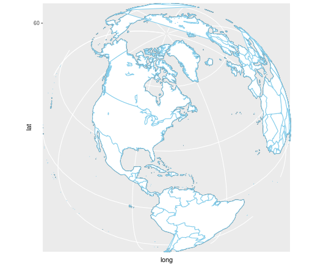

> “If we rely on intuitions of doubtful validity, we run a serious risk of making inaccurate predictions or over confidence decisions.”  Joe Blitzstein


## Motivation

The adage  _hind sight is 20/20_ is often used to refer how much clearer certain situations were after learning some new facts. Most of us, at one point or another,  may have said 'had I known x took place, I would have done y'. For example, had I known it it was going to get windy, I would have worn my winter jacket.  Had I known event x happened with my customer, I would have adjusted and given this option or discount, or chosen this route.  A 'given this, then that' type of scenario simulation testing is possible if we factor in, what is known in the statistics world, [conditional probability](https://en.wikipedia.org/wiki/Conditional_probability).  Applying 'conditional probability' to a problem increases accuracy to our response by  noticeable magnitude.   **“Conditional probability tells us how to update our belief in light of a new evidence that comes in."[2]**  Therefore, applying conditional statistics, based on actual data, will give us our best chance to understand and make decisions that are important.

On this blog  I will cover how we can use _statical regression analysis to predict_ an outcome that can be used to make inference. We will look at real world example from a real world dataset.   Using a least square linear fitted regression, to demonstrate a relationship between geolocation(independent variable) and temperature (dependent) variable.  We will first generate the dataset from three data sources and discuss the tidy process, followed by exploring and  visualizing the data, and finally  generating,  evaluating and validating the model.  Ultimately, we will use the model to predict temperature, given the latitude of a given location in the US.  

## Scenario

Suppose, for example, a farmer in the United States (US) decides to grow coffee instead of corn, and he learned that one of the key ingredients in successful coffee farming is optimal seasonal temperature (We will use the month of April, as the start of spring which is ideal plant coffee). The farmer wants to decide on a location  to buy a farm.  He learned that [National Oceanic and Atmospheric Adminstration - NOAA](http://www.ncdc.noaa.gov/) keeps historical weather information for all major cities in the US, and wants to simulation model that will help him identified areas that he would consider for purchase. In short, he want to plug in latitude of location, and gets back temperature for that geolocation. 


## Explore the data

The first order of business, as always, is to obtain data that will help extract temperature data in the US. NOAA collects and archives weather data from around the US. So we will be using the seasonal monthly average temperature dataset for 116 major US cities found [here](http://www.infoplease.com/ipa/A0762183.html), and merge it with the US cities geolocation dataset found in the `maps` package, to get our tidy data set for this analysis. The Tidy process includes formatting the datasets, renaming feature names, selecting features and merging the datasets. The `dplyr and reshape2` R packages were used for cleaning the dataset. The code used to tidy the data data can be found on [my github repository](https://github.com/abiyug/regression).

```{r, echo=FALSE, warning=FALSE, message=FALSE}
## Load the library
library(dplyr)
library(maps)
library(reshape2)
library(leaflet)
library(ggplot2)
library(ggmap)
library(gridExtra)

## Download and tidy the data

# dataset 1 us.cities

data(us.cities)                                                 #load the us.cities data from the 'maps' pkg
# tidy df1
df1 <- tbl_df(us.cities)                                        #load it to table df
df1$name <- tolower(df1$name)                                   #convert names to lower

city <- df1$name                                                # splsit name column heading to city to tidy it
city <- gsub('.{3}$', '', city)                                 # remove the last three chracters - space and state code

df11 <- cbind(city, df1[,-1])                                         # clean df1
names(df11) <-  c("city", "state", "popln", "lat", "long", "capital") # rename heading  

# dataset 2 us regions
us_state_region <- read.csv("~/Documents/DataScience/Blog/regression/data/us_state_region.csv")

df_city_region <- dplyr::inner_join(df11, us_state_region, by="state") # add us region to the table
                                      
df_city_region <- tbl_df(df_city_region) %>% 
                        select(city, state, region, lat, long, popln)  #select pertinent columns

# dataset 3
# download from NOAA
us_weather <- tbl_df(read.csv("~/Documents/DataScience/Blog/regression/data/us-cities-monthly-weather-noaa-2.csv"))

## Tidy df2

df3 <- colsplit(tolower(us_weather$City), ",", c("city", "state"))  #split city column before and after comma
df3 <- df3[,-c(2)]                                                   #remove column 2
df31 <- cbind(df3, us_weather[,-1])                                 #remove city column from us_weather - redundunt
names(df31) <-  c("city", "jan", "apr", "jul", "oct")               #convert names to small letters

# Inner join the two datasets with dplyr
df_combo <- dplyr::inner_join(df_city_region, df31, by="city")


# Final data set
us_weather_df <- tbl_df(df_combo) %>% 
                    select(city, state, region, jan, apr, jul, oct, lat, long, popln) %>% 
                                                                                     arrange(lat)

```

The resulting table is displayed here using the datatable function from 'Data Table' package. 
```{r, echo=FALSE, warning=FALSE, message=FALSE}
DT::datatable(us_weather_df)
```
**_Table 1: US major cities seasonal average monthly temprature. Source NOAA._**

## Visualizing the data
Before any further analysis, we are going to visualize and see if any information can be gleaned from it.  The following R graphics packages were used for interactive data visualization `ggplot2, leaflet and plotly`.  By clicking on the data points and drilling down, one can see the average monthly temperature for all of the major cities in the US.


```{r, echo=FALSE, warning=FALSE, message=FALSE, fig.width=8, fig.height=6, fig.align='center' }


weatherIcon <- makeIcon(
                         iconUrl = "./fig/weather.png",
                         iconWidth = 30, 
                         iconHeight = 30
                        )

popupInfo <- paste(us_weather_df[['city']], 
                   ", ", 
                   us_weather_df[['state']],
                   "<br>", 
                   "Average January Temp in F:  ",
                   us_weather_df[['jan']],
                   "<br>", 
                   "Average April   Temp in F:  ",
                   us_weather_df[['apr']],
                   "<br>", 
                   "Average July    Temp in F:  ",
                   us_weather_df[['jul']],
                   "<br>", 
                   "Average October Temp in F:  ",
                   us_weather_df[['oct']],
                   sep='')


us_mainland_temp <- leaflet(us_weather_df) %>% 
                          setView(-93.65, 42.0285, zoom = 4) %>%
                                 addTiles() %>%
                                      addMarkers(~long, ~lat, popup= ~ popupInfo,
                                      options = popupOptions(closeButton = TRUE),
                                      clusterOptions = markerClusterOptions(), 
                                      icon = weatherIcon)


us_mainland_temp
```
**_Figure 1: Interactive 116 US major cities and their respective monthlyaverage temprature_**

As can be seen, before even starting the statistical analysis, the table and the map, we can observe that the average temperature generally is warmer in south and south west vs the Midwest or east, for instance.  

Now, lets get to the fun part and start by looking at the scatter plot for latitude vs temperature. We used `ggplot2` for the scatter plot and [fit a least square](https://en.wikipedia.org/wiki/Least_squares) linear curve to the data. There are different kinds of curves to fit to the data besides linear - the  quadratic, cubic, quadratic, nth-degree and so on, the data dictates the type of curve chosen for the model. On this case, data fits a best with linear (straight line) regression line.


## Modeling with Regression Analysis

Because the surface temperature on earth, is often, depends on geolocation measured by latitude and longitude, and this information is not influenced by temperature,we will use the latitude data as explanatory variable (x axis), the temperature as response variable (y-axis) for scattered plot.  To generate the linear plot on the graph, we will use R's linear model function (lm) to fit the Least [Squared Regression (LSR)](http://www.itl.nist.gov/div898/handbook/pmd/section1/pmd141.htm) line.  LSR, also known as `goodness of fit`, which means how well the model fits the set of observed data. 

```{r, echo=FALSE, warning=FALSE, message=FALSE, fig.width=6, fig.height=4, fig.align='center' }
q1 <- qplot(region, apr, colour = region, data = us_weather_df, geom = c("boxplot", "jitter"))
q2 <- q1 + geom_smooth(method = "lm", colour = "red", size = 2) + 
         ggtitle("April Temprature by region") +
         xlab("Regions") +
         ylab("April temprature in F") +
         theme_minimal() +
         theme(plot.margin = unit(c(1,1,1,1), "cm")) 

p <- qplot(lat, apr, colour = region, size = 1, alpha = .33, data = us_weather_df) #facets = . ~ region
 
p1 <- p + geom_smooth(method = "lm", colour = "red", size = 2) + 
         ggtitle("US Cities Average April temprature along latitude") +
         xlab("Lattitude coordinates") +
         ylab("April temprature in F") +
         theme_minimal() +
         theme(plot.margin = unit(c(1,1,1,1), "cm")) 
           
```

```{r, echo=FALSE,fig.width =10,fig.height =4, fig.align='center' }
grid.arrange(q2, p1, nrow=1, ncol=2)
```
**_Figure 2: The Figure on the left shows the boxplot temperature frequency distributions for each of the 4 regions in the US. The figure on the right shows linear model fit that shows negative correlation between latitude and temperature. As temperature decreases the latitude increases._**  

### Fitting the Linear regresion model
A regression analysis gives an output that lists statistical relationships between predictor variable (latitude) and the response variable (temperature). The more significant outputs, for this example, that validate the model fit, including _residual error_, _$R^2$_, and _p-value_, will be discussed below. 

To generate a model,  we use the _linear model_ (lm) function in `R` to carry out the regression single stratum analysis, to produce an equation we will use for prediction.  **Which is the model will give us an estimation for temprature given the value for latitude.**


```{r, echo=TRUE, warning=FALSE, message=FALSE}
attach(us_weather_df)
regression.lm <- lm(apr ~ lat)
regression.lm
```
The value for the `cofficient` gives the values for the intercept `101` and the slope `-1.2` for the fitted regression line. 

Therefore, the model equation we will use to predict temperature can be written as follows:

$Y = a_0 + a_1 X$                              (1)

Or can be written on our case <br>

$Temprature = 101 - 1.2 lat$                   (2)

Plugging a latitude values  range  between `r range(us_weather_df$lat)` to get temperature prediction. Now, before we confirm this is the model we will use we need to evaluate and validate our model.

##Evaluating our model
We will be using R `summary` function to look at the various model assumptions and evaluate how well our model fits the data. We will use the `summary` function to view the regression model. 

```{r, echo=TRUE, warning=FALSE, message=FALSE}
summary(regression.lm)                          # summary of the regression model
```

There are lots of information to parse here, but the once we are interested for evaluating and validating our models are residual error, p value, $R^2$, and the coefficients (which was covered earlier).

### Residual Error
Residual error, in statistics, are referred to the `true` error and the plots will measure of the variation in the response variable (temp) due to error. Before we validate our model and give it thumbs up, we  must check the `residual error` plot. If the plot shows no discernible pattern, then it is considered the model assumption is accepted. If there is pattern in the error plot, there is flow and we need to remodel with different fitted line. 

Lets take a look at the 


```{r, echo=FALSE, warning=FALSE, message=FALSE, fig.width=6, fig.height=4, fig.align='center' }

p <- qplot(lat, resid(regression.lm), colour = region, size = 1, alpha = .33)

p1 <- p + geom_hline(yintercept = 0,  size = 2, col = "red") + 
         ggtitle("Resiual error plot") +
         xlab("Lattitude coordinates") +
         ylab("April temprature in F") +
         theme_minimal() +
         theme(plot.margin = unit(c(1,1,1,1), "cm")) 
p1
           
```
**_Figure 3:  Because the resulting plot shows the random residual error patterns, we can confirm that the model is systematically correct for the fitted values! Otherwise, we can go back to plotting another least squared linear line to help improve the model._** 

### $R^2$ Goodness of fit measure

I The formal definition of $R^2$ is "the percentage of variation in the response that is explained by the model". Generally, the higher the $R^2$ value the better the fit to the data, the tighter the scatter plots are around the line,  which indicates a higher correlation between the predictor (lat) and the response(temp). n our model we see that $R^2$ value is `0.67` which is acceptable for our purposes. 


### p value 

The P value for bot the intercept and the slope is tests a null hypothesis that the coefficient is equal to zero or it has no effect.  A good indication for a change in latitude is related to a change in temperature.

```{r, echo=TRUE, warning=FALSE, message=FALSE }
coef(summary(regression.lm))                           # extract standard error, t-value, p-value
```

Because p-value $2.65^-60$ and $1.76^-29$ are both less than 0.05, we reject a null hypothesis. Which means predictor **is very likely an meaningful contributor to our model**.


## Prediction
If we input the latitude into the model,  we can now use our model to predict the temperature.  The weather data is only for the US only. For example, if we want see what the temperature for latitude 25  and 55 degrees, we can do the following.

```{r, echo=TRUE, warning=FALSE, message=FALSE }
new_lat <- data.frame(lat = c(25, 55))                    # New latitude to get temp prediction for 
pred <- predict(regression.lm, new_lat)                   # use the model to predict temp
df1 <- cbind(latitude = new_lat, Predicted_Temp = pred)   # combine the result for display
#DT::datatable(round(df1, 2))
df1
```

## Checking confidence for our predction
When using a mode it is more appropriate to give a range or interval for the predicted temperature rather than a single value, due to margin of error consideration. Therefore, we will use the confidence interval option in the predict function,  to get temperature values in 95% confidence interval range for a given set of latitude. Here is an example prediction for randomly chosen six different latitudes.

```{r, echo=TRUE, warning=FALSE, message=FALSE }
new_lat <- data.frame(lat = c(21, 28, 34, 49.3, 52.2, 60.1))        # latitude data for prediction

predict <- predict(regression.lm, new_lat, interval ='confidence')  # predicted value with 95% confidence

predict <- round(predict,2)                                         # roudn to two digits

DT::datatable(cbind(new_lat, predict))                              # in data talble for better display
```
**_Table 2: The table can be explained as follows for latitude starting from  21 to 60.1 degree, the average temperature, for the month of April,  is between lower and upper digits. For example, for 21 degree lat, temp is between 72.64	& 78.32 degree Fahrenheit._**

## Take Away
Here we have seen that given historical temperature data and the geolocation coordinate data, we have demonstrated linear relationship, and generated a model that will predict reasonable temperature given the latitude within the US.

-  Resulting analysis confirms that weather at higher altitude in the continental US are generally cooler (N. East, Midwest) than they are in the lower latitude (West).

- The model can predicts the temperature with 95% confidence interval with acceptable margin of error, given the latitude of the location. 

- The farmer who wanted to identify a location with optimal weather can use this model, and the map, to interactively get prediction when he input latitude for interested location. 

_Note: The model can be embeded in a web app and be made avialble to other farmers.  Perhaps I will develop and share the app or a dashboard using a RStudio shiny frame work._

## Code
[The full program and data for this paper is found on my github respository](https://github.com/abiyug/regression)

## References
[1] (US Department of commerce)[http://www.itl.nist.gov/div898/handbook/pmd/section1/pmd141.htm] _Engineering Statstics handbook_  <br>
[2J J. Blitzstein and J. Hawang - _Introduction to Probability_, CRC press <br>
[3] B. Caffo _Regression Models for Data Science in R_ JHU lean pub <br>
[4] G. Hystadd lecture  _Simple Linear Regerssion_ <br>
[5] Weather data is obtained from from National Oceanic & Atmospheric Administration (NOAA)<br>
[6] wikipedia.org/wiki/

**This document is fully reproducible** <br>